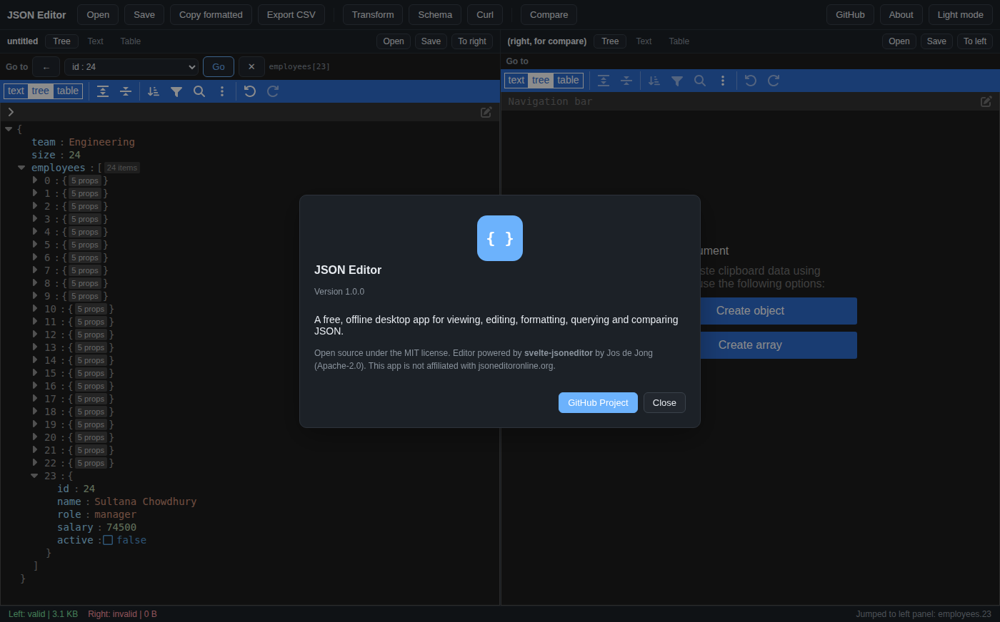

# JSON Editor

A free, offline desktop app for working with JSON files. Works on macOS, Linux, and Windows.


| | |
| --- | --- |
|  |  |
| **Curl executor** - run an API call, inspect the response | **About** - version, license, project links |

## What can it do?

- **Edit JSON easily** in three views: a clickable tree view, plain text, and a spreadsheet-style table view.
- **Two panels side by side**, so you can keep two documents open, copy between them, and compare them.
- **Transform** the document with a query: JavaScript expressions, lodash, JMESPath, or jq. For example, keep only the items you care about, or pull one value out of a big file.
- **Path navigator ("Go to")**: jump straight to any nested item from dropdowns, with previews. Great for finding the last item of a large API response without scrolling.
- **Curl executor**: paste a curl command, run it, and load the JSON response straight into a panel.
- **Compare** two documents and see every difference: added, removed, or changed values.
- **Validate** a document against a JSON Schema and see exactly which lines break the rules.
- **Repair** broken JSON (missing quotes, trailing commas, JavaScript-style objects) with one click.
- **CSV export**: turn a JSON array into a CSV file.
- **Dark mode**, remembered between sessions.

Everything runs locally. No account, no internet connection needed (the curl feature is the only thing that uses the network, and only when you run a command).

## Download

Grab the latest installer from the [Releases page](https://github.com/jamilxt/json-editor-desktop/releases/latest):

| System | File |
| --- | --- |
| macOS (Apple Silicon, M1/M2/M3/M4/M5) | `JSON.Editor-<version>-arm64.dmg` |
| macOS (Intel) | `JSON.Editor-<version>.dmg` |
| Windows | `JSON.Editor.<version>.exe` |
| Linux | `JSON.Editor-<version>.AppImage` or `.deb` |

**macOS first run:** the app is not code-signed with an Apple Developer certificate, so macOS may block it. If you see "JSON Editor.app is damaged and can't be opened", do NOT delete it. Open Terminal and run:

```bash
sudo xattr -rd com.apple.quarantine /Applications/JSON\ Editor.app
```

Then open the app normally. You only need to do this once.

## How to use it

1. Open a JSON file with the **Open** button, or drag a file onto the window, or just paste JSON text.
2. Switch between **Tree**, **Text**, and **Table** views with the tabs at the top of each panel.
3. Edit in any view. The other views update instantly.
4. Use **Transform** to filter or reshape the document with a query.
5. Use **Go to** to jump to a deep property: pick a key or an array index from the dropdowns, then press Go. The editor scrolls there and expands it.
6. Paste a curl command into the **Curl** dialog to fetch a live API response into either panel.
7. Press **Compare** to diff the left and right documents.
8. Save with **Ctrl/Cmd+S**, or **Export CSV** to get a spreadsheet file.

## Keyboard shortcuts

| Shortcut | Action |
| --- | --- |
| Ctrl/Cmd+O | Open file |
| Ctrl/Cmd+S | Save left document |
| Ctrl/Cmd+D | Toggle dark mode |

## About this project

This app is open source under the [MIT license](LICENSE). It is built on the excellent [svelte-jsoneditor](https://github.com/josdejong/svelte-jsoneditor) library by Jos de Jong (Apache-2.0), the same engine that powers jsoneditoronline.org. This project is not affiliated with jsoneditoronline.org.

## Build it yourself

You need Node.js 18 or newer.

```bash
git clone https://github.com/jamilxt/json-editor-desktop.git
cd json-editor-desktop
npm install
npm run build
npm start
```

To package installers for all platforms, push a tag like `v1.2.0` and GitHub Actions builds them automatically (see `.github/workflows/release.yml`).

## Troubleshooting

**"Electron failed to install correctly" when running `npm start`:** the Electron binary download was skipped or interrupted. Fix:

```bash
rm -rf node_modules/electron
npm install electron
```

If your network blocks the download, use a mirror:

```bash
rm -rf node_modules/electron
ELECTRON_MIRROR="https://npmmirror.com/mirrors/electron/" npm install electron
```

**Paste does not work in a text field on macOS:** update to the latest version. Older builds missed the Edit menu roles that macOS requires for clipboard shortcuts.
