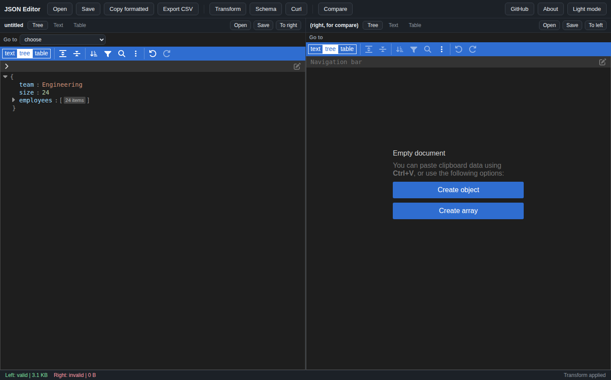
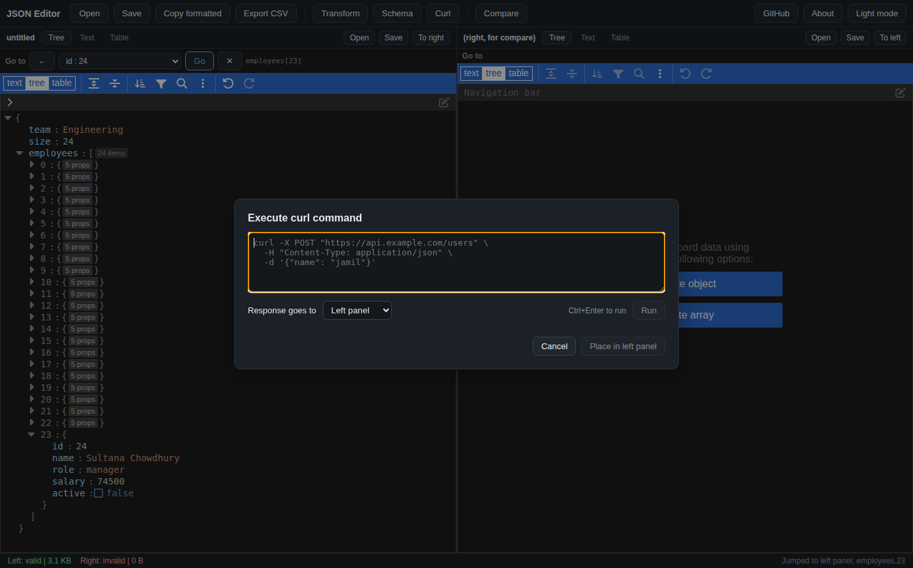

# JSON Editor

A free, offline desktop app for working with JSON files. Works on macOS, Linux, and Windows.



## What can it do?

- **Edit JSON easily.** Switch between three views any time: a clickable tree, plain text, and a spreadsheet-like table.
- **Format and fix broken JSON.** Paste messy JSON and the app repairs it automatically when it can (missing quotes, trailing commas, single quotes, and similar problems).
- **Query your data.** Open the Transform modal and filter or reshape your JSON using JavaScript, lodash, JMESPath, or jq. You see a preview before anything changes.
- **Run curl commands.** Paste any curl command, run it, and load the response straight into a panel. Great for testing APIs.



- **Compare two files.** Open one file on the left and another on the right, click Compare, and see every difference: what was added, removed, or changed.
- **Check against a JSON Schema.** Paste a schema and the status bar shows whether your document matches it.
- **Convert to and from CSV.** Drop a .csv file to convert it to JSON, or export your JSON as CSV.
- **Work with big files.** The tree view loads large documents without freezing.
- **Dark mode.** One click to switch, and the app remembers your choice.

Everything runs on your computer. The app never sends your data anywhere and does not need an internet connection.

## Download

Go to the [Releases page](https://github.com/jamilxt/json-editor-desktop/releases/latest) and download the file for your system:

| System | File |
| --- | --- |
| macOS (Apple Silicon, M1/M2/M3/M4/M5) | `JSON.Editor-1.0.0-arm64.dmg` |
| macOS (Intel) | `JSON.Editor-1.0.0.dmg` |
| Windows | `JSON.Editor.1.0.0.exe` |
| Linux | `JSON.Editor-1.0.0.AppImage` or `json-editor-desktop_1.0.0_amd64.deb` |

**macOS first run:** the app is not code-signed with an Apple Developer certificate, so macOS may block it. If you see "JSON Editor.app is damaged and can't be opened", do NOT delete it. Open Terminal and run:

```bash
sudo xattr -rd com.apple.quarantine /Applications/JSON\ Editor.app
```

Then open the app normally. You only need to do this once. (The file is not actually damaged. macOS adds a "quarantine" marker to downloaded files, and unsigned apps with that marker are refused on Apple Silicon Macs.)

## How to use it

1. **Open a file:** click Open, or just drag a file from Finder/Explorer onto either panel.
2. **Switch views:** use the Tree, Text, and Table buttons at the top of each panel.
3. **Format your JSON:** the tree and table views always show clean, formatted JSON. To save it formatted, click Copy formatted, then paste it anywhere.
4. **Run a query:** click Transform, pick a language, type your query, click Preview, then Apply. Example: `json.services.filter(s => !s.healthy)` shows all unhealthy services.
5. **Run a curl command:** click Curl, paste your command, press Ctrl+Enter (or Cmd+Enter on Mac), then choose which panel receives the response.
6. **Compare files:** open file A on the left and file B on the right, then click Compare.
7. **Save:** click Save. The app offers to repair first if the document is invalid.

**Keyboard shortcuts:** Ctrl/Cmd+O opens a file, Ctrl/Cmd+S saves, Ctrl/Cmd+D toggles dark mode, Ctrl/Cmd+Enter runs a curl command.

## Run from source

You need Node.js 18 or newer.

```bash
git clone https://github.com/jamilxt/json-editor-desktop.git
cd json-editor-desktop
npm install
npm run build
npm start
```

If `npm start` fails with "Electron failed to install correctly", your npm skipped the download step. Run `npm config get ignore-scripts`. If it prints `true`, run `npm config set ignore-scripts false`, delete the `node_modules` folder, and run `npm install` again. Slow networks can also cause it; retrying the install usually fixes it.

## Build an installer

```bash
npm run build
npx electron-builder --config electron-builder.yml
```

The installer appears in the `release/` folder. To build for all three systems at once, push a tag like `v1.0.1` and GitHub Actions builds them for you (see `.github/workflows/release.yml`).

## Credits and license

Built with [svelte-jsoneditor](https://github.com/josdejong/svelte-jsoneditor), [jsonrepair](https://github.com/josdejong/jsonrepair), and [ajv](https://github.com/ajv-validator/ajv) by Jos de Jong and contributors, plus [jq-wasm](https://github.com/owickstrom/gmahi) for real jq support.

This project is not affiliated with JSON Editor Online (jsoneditoronline.org) or Jos de Jong.

Licensed under the [MIT License](LICENSE).
